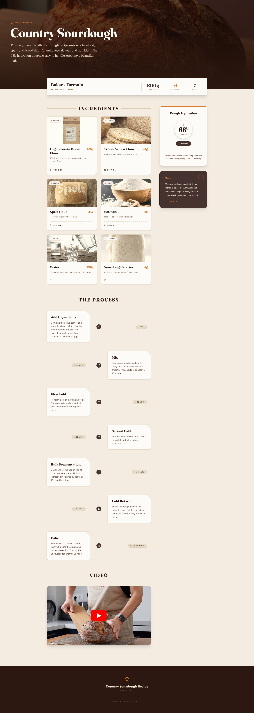

# Country Sourdough
One pager built using Google AI Studio/React/Vite/TailwindCSS

This beginner-friendly sourdough recipe uses whole wheat, spelt, and bread flour for enhanced flavour and nutrition. The 68% hydration dough is easy to handle, creating a beautiful loaf.

